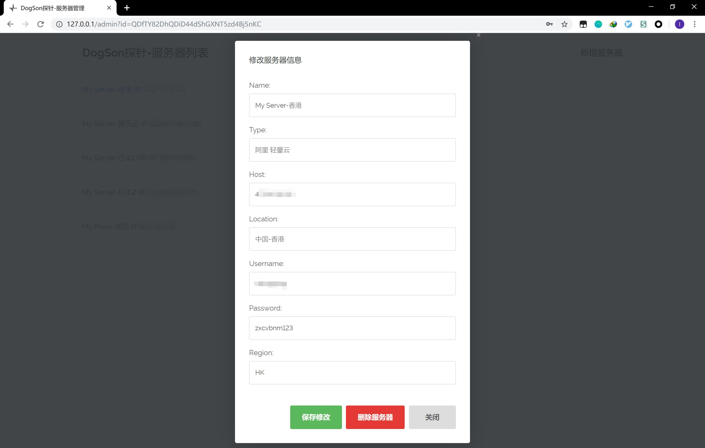

ServerStatus-DogSon
===================

云探针，多服务器探针，云监控，多服务器云监控

根据ServerStatus-Hotaru的前端Web UI，基于Node.JS重写而来的。

目前是0.0.1测试版，多服务器探针服务已经完成，下个版本更新admin面板，支持在线添加服务器。

最新更新
====

新增Admin功能，在线添加服务器，无需手动修改配置文件，下面是登录界面

下面是管理界面

使用方法
====

服务器端
----

修改conf/conf.js下的服务器信息

在data.json中添加服务器信息

在服务器启动main.js

客户端
---

修改client/conf/conf.js

演示
==

相关开源项目
======

ServerStatus-Toyo：[https://github.com/CokeMine/ServerStatus-Hotaru](https://github.com/CokeMine/ServerStatus-Hotaru)

ServerStatus-Toyo：https : //github.com/ToyoDAdoubiBackup/ServerStatus-Toyo

ServerStatus：https : //github.com/BotoX/ServerStatus

mojeda：https：//github.com/mojeda

mojeda的ServerStatus：https : //github.com/mojeda/ServerStatus

BlueVM的项目：http : //www.lowendtalk.com/discussion/comment/169690#Comment_169690##
